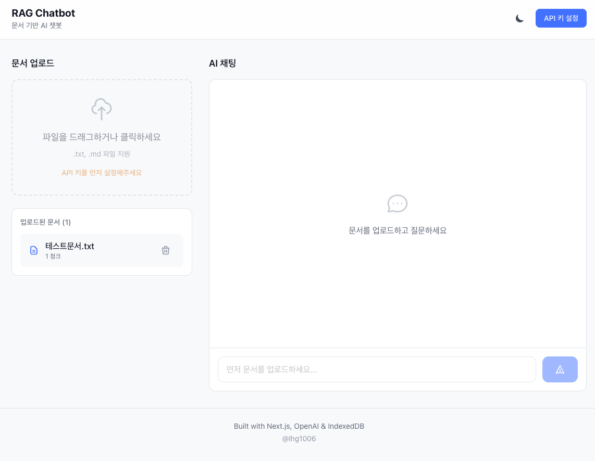
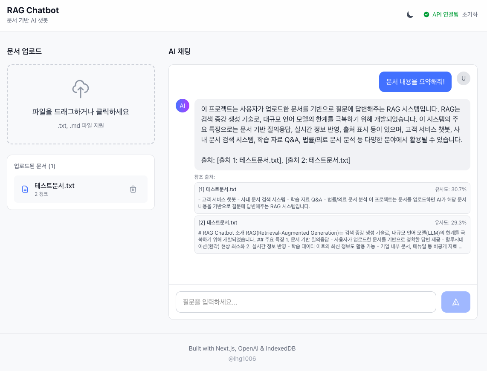

# RAG Chatbot

문서 기반 AI 챗봇 - RAG(Retrieval-Augmented Generation) 시스템




## 주요 기능

- **문서 업로드**: txt, md 파일 드래그앤드롭 업로드
- **AI 채팅**: 업로드한 문서 기반 질의응답
- **출처 표시**: 답변의 근거가 되는 문서와 유사도 표시
- **로컬 저장**: IndexedDB를 활용한 브라우저 내 문서 저장

## 기술 스택

| 분류 | 기술 |
|------|------|
| Frontend | Next.js 16, React 19, TypeScript |
| AI | OpenAI GPT API |
| Storage | IndexedDB (idb) |
| Styling | Tailwind CSS |
| Animation | Framer Motion |

## 시작하기

### 1. 설치

```bash
npm install
```

### 2. 환경 변수 설정

```bash
# .env.local
OPENAI_API_KEY=your-openai-api-key
```

### 3. 실행

```bash
npm run dev
```

http://localhost:3000 에서 확인

## 사용 방법

1. 우측 상단 "API 키 설정" 버튼 클릭 후 OpenAI API 키 입력
2. 좌측 영역에 문서 파일(.txt, .md) 드래그앤드롭
3. 우측 채팅창에서 문서에 대해 질문

## 프로젝트 구조

```
src/
├── app/
│   ├── api/          # API Routes (OpenAI 연동)
│   └── page.tsx      # 메인 페이지
├── components/       # React 컴포넌트
└── lib/              # 유틸리티 함수
```

## 라이선스

MIT License
